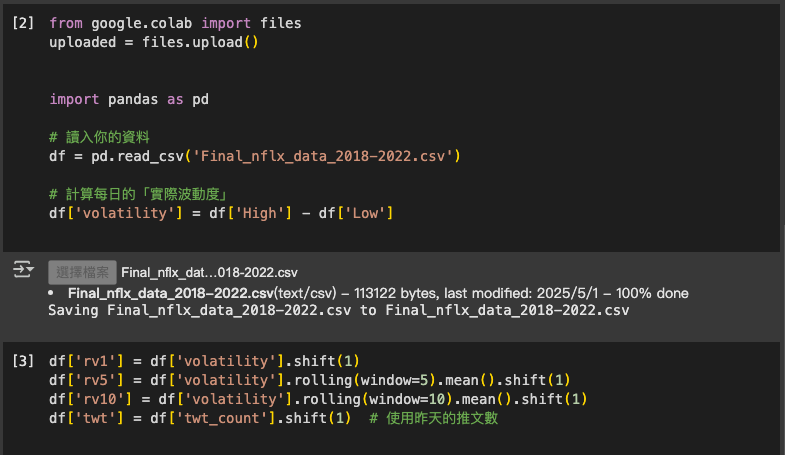
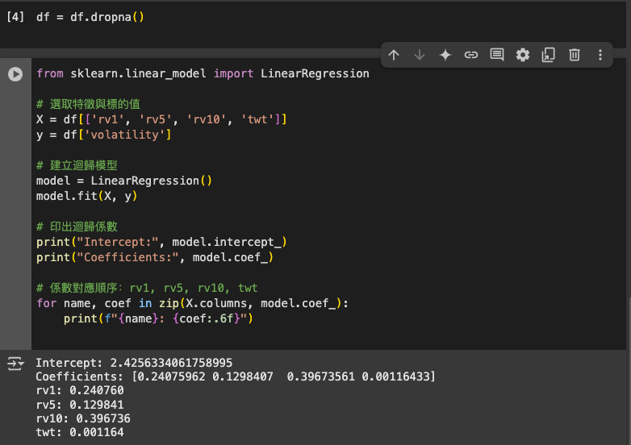
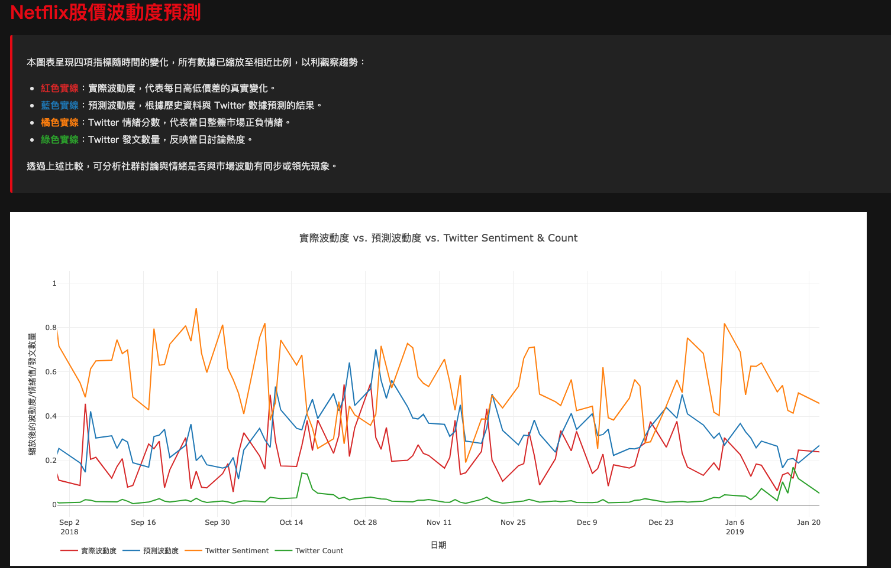

# 《The Twitter Myth Revisited: Intraday Investor Sentiment, Twitter Activity and Individual-Level Stock Return Volatility》

「股票在短時間內的價格變化，會受到 Twitter 上的言論影響嗎？」
假設你是投資人：
你看到某支股票突然在 Twitter 上被瘋狂討論、很多人喊會漲，那你會不會因此買進，造成股價真的上漲（或波動）？

### 目標與背景

本研究旨在探討 Twitter 情緒與推文數量是否能用來預測股票價格的波動率。研究使用了 2015 年 6 月 18 日到 2017 年 12 月 29 日之間，所有道瓊工業指數成分股的 Twitter 資料（每分鐘頻率的推文數量與情緒），並將其與這些股票的價格波動（以每 5 分鐘報酬的絕對值表示）進行比較分析。

Twitter 數據：
Twitter 數量：每分鐘內某檔股票被發文的總數。若該分鐘沒有推文，數量為 0。

Twitter 情緒：情緒分數範圍為 -1（負面情緒）至 1（正面情緒），計算依據 Bloomberg 內部演算法（未公開）。情緒每 30 分鐘重新計算一次，當情緒變化大於 0.005 時才會更新。

用數學模型看看：
Twitter 的資料是否能預測之後的股價「波動程度」

目標：
探討 Twitter 情緒與推文數量對股價波動率的預測能力。

分析兩者與股價波動率之間的關聯性。

### 模型與方法

2.1 VAR 模型
本研究使用簡單的雙變量 VAR（向量自我回歸）模型，來分析 Twitter 情緒與推文數量對股價波動率的影響。

2.2 衝擊反應分析
當股價波動突然增加時（10% 衝擊），Twitter 情緒稍微下降，但影響不明顯。

- 分析：

- 波動率的變動對 Twitter 情緒和推文數的影響

- Twitter 情緒與推文數對波動率的反向影響

當 Twitter 情緒或推文數量突然上升時，股價波動的變化極小，幾乎可以忽略不計。

### 程式碼功能

這段程式碼用於根據股價與 Twitter 資料來預測股價的波動率。
使用的波動度預測模型，參考 HAR (Heterogeneous Autoregressive) 模型架構，結合短期、中期、長期歷史波動度與社群媒體變數進行預測。

計算波動度：計算每筆資料的股價波動，即 High - Low。

計算移動平均：根據過去 5 筆和 10 筆資料計算波動度的移動平均，這樣可以平滑掉短期的變動，得到更穩定的預測。

預測波動度：根據以下公式預測波動度：

```ini
forecast=2.4256+0.2408⋅rv1+0.1298⋅rv5+0.3967⋅rv10+0.001164⋅twt
```

其中：

rv1：前一日的波動度（High - Low）

rv5：過去 5 日的平均波動度

rv10：過去 10 日的平均波動度

twt：前一日的推文數量（Twitter Count）

### 係數來源

上述公式中的係數並非任意設定，而是根據歷史資料利用線性迴歸（Linear Regression）進行估計所得。具體流程如下：

資料來源：使用包含每日股價資訊與社群媒體指標（如推文數、情緒分數等）的時序資料集，欄位包括 date, High, Low, twt_count 等。

目標變數：以當日的波動度（High - Low）作為迴歸目標。

自變數：

rv1: 前一日的波動度

rv5: 前 5 日的平均波動度

rv10: 前 10 日的平均波動度

twt: 前一日的推文數量

模型訓練：採用 Python 的 scikit-learn 套件進行線性回歸建模與係數估計。
[python程式碼](https://colab.research.google.com/drive/1DSvQkgkvJ0Ig1Z_g9QrlBv2QdO7SmGzW?usp=sharing)




結果：

截距（intercept）：2.4256

rv1 係數：0.2408

rv5 係數：0.1298

rv10 係數：0.3967

twt 係數：0.001164

### 實作

直接開啟

```ini
netflix.html
```

### 結果



### 參考資料集：

https://www.kaggle.com/datasets/kirolosatef/netflex-stock-dataset-with-twitter-sentiment
